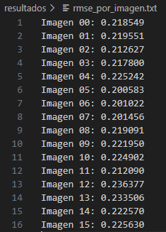

## Equipo:

## - Emilio Fernández Pouget
## - Derek André Beltrán Arguelles 
## - Gustavo Abraham Flores Galindo
## - Josecarlo Porchas López

### Kernel 1: Escala de grises

Este kernel convierte un batch de imágenes RGB (4D: B×3×H×W) a escala de grises (3D: B×H×W). 

- **Entrada:** tensor 4D de floats (RGB)  
- **Salida:** tensor 3D de floats (grises)  
- **Grid:** 2D con bloques de 16×16 hilos  
- **Fórmula usada:** Gris = 0.2989*R + 0.5870*G + 0.1140*B  
- **Notas:** Cada hilo procesa un píxel (fila, columna) de cada imagen, y un loop interno recorre las imágenes del batch. Se deja en la GPU la salida para pasar al siguiente kernel sin transferencias intermedias a CPU.

### Kernel 2: Detección de bordes (Sobel)

Este kernel aplica el filtro Sobel para detectar bordes en un batch de imágenes en escala de grises (3D: B×H×W).

- **Entrada:** tensor 3D de floats (grises)  
- **Salida:** tensor 3D de floats (bordes detectados)  
- **Grid:** 2D con bloques de 16×16 hilos  
- **Fórmula:** Magnitud = sqrt(Gx² + Gy²), donde Gx y Gy son convoluciones con los kernels Sobel estándar  
- **Notas:** Los píxeles de borde (primera y última fila/columna) se dejan en 0. Cada hilo procesa un píxel y un loop interno recorre todas las imágenes del batch. La salida permanece en GPU para el siguiente kernel.

### Kernel 3: Normalización

Este kernel normaliza cada imagen del batch al rango [0,1] en dos pasos:

1. **Reducción para máximo por imagen:**  
   - Encuentra el valor máximo de cada imagen usando memoria compartida (`__shared__`) y `atomicMax`.
2. **División de cada píxel:**  
   - Cada píxel se divide entre el máximo de su imagen para obtener valores entre 0 y 1.

- **Entrada:** tensor 3D de floats (bordes detectados)  
- **Salida:** tensor 3D de floats (normalizado)  
- **Grid:** 2D con bloques de 16×16 hilos  
- **Notas:** Cada imagen del batch mantiene su máximo independiente, y todo permanece en GPU para el siguiente kernel.

### Kernel 4: Cálculo de RMSE vs imagen de referencia

Este kernel compara cada imagen normalizada del batch contra una imagen de referencia única y devuelve un vector 1D con el RMSE por imagen.

- **Entrada:** tensor 3D de floats (normalizado), imagen de referencia 2D (H×W)  
- **Salida:** vector 1D de floats (RMSE por imagen)  
- **Grid:** 1D, reducción usando memoria compartida (`__shared__`)  
- **Fórmula:** 
  MSE[b] = promedio( (entrada[b][i] - referencia[i])² )  
  RMSE[b] = sqrt(MSE[b])  
- **Notas:** Cada hilo procesa un píxel, se realiza reducción en shared memory para obtener MSE y luego RMSE por imagen. La salida se mantiene en GPU para posterior transferencia a CPU.

## Main.cu — Orquestación del pipeline

`main.cu` coordina la ejecución completa del programa, desde la carga del batch hasta el guardado de resultados:

1. Lee todas las imágenes de entrada desde la carpeta `imagenes/` usando `cargar_png_rgb` de `utils/imagen.cu`.
2. Valida que todas las imágenes tengan las mismas dimensiones y arma un batch RGB en formato `B x 3 x H x W`.
3. Crea la carpeta `resultados/` si no existe.
4. Reserva memoria en GPU para la entrada, las salidas intermedias, los máximos por imagen, la referencia y el vector de RMSE.
5. Copia el batch completo de CPU a GPU y mide la transferencia `H→D`.
6. Prepara en GPU una imagen de referencia en escala de grises a partir de la primera imagen del batch.
7. Ejecuta los cuatro kernels principales:
   - **Kernel 1:** conversión a escala de grises.
   - **Kernel 2:** detección de bordes con Sobel.
   - **Kernel 3:** normalización por imagen.
   - **Kernel 4:** cálculo de RMSE contra la referencia.
8. Mide el tiempo individual de cada kernel con `cudaEvent` mediante `utils/timer.cu`.
9. Calcula el **tiempo total del pipeline** como la suma de los cuatro kernels, sin incluir transferencias.
10. Copia a CPU las salidas de grises, bordes, normalización y RMSE, midiendo también la transferencia `D→H`.
11. Ejecuta una implementación CPU equivalente de las mismas cuatro etapas para comparar contra los kernels GPU.
12. Reporta el speedup como `tiempo CPU equivalente / tiempo total de kernels GPU`.
13. Guarda en `resultados/` las salidas de todas las imágenes del batch:
   - `imagen_00_original.png`, `imagen_00_grises.png`, `imagen_00_bordes.png`, `imagen_00_normalizada.png`
   - ...
   - `imagen_15_original.png`, `imagen_15_grises.png`, `imagen_15_bordes.png`, `imagen_15_normalizada.png`
14. Guarda los valores del Kernel 4 en `resultados/rmse_por_imagen.txt`.
15. Libera la memoria reservada en CPU y GPU.


# Resultados


### Tiempos medidos en GPU de Colab

| Métrica | Tiempo |
|---|---:|
| Transferencia H→D | 10.942 ms |
| Kernel 1 - Grises | 0.295 ms |
| Kernel 2 - Bordes | 0.432 ms |
| Kernel 3 - Normalización | 0.773 ms |
| Kernel 4 - RMSE | 0.821 ms |
| Tiempo total del pipeline | 2.321 ms |
| Transferencia D→H | 32.275 ms |
| Transferencias H→D + D→H | 43.217 ms |
| Tiempo CPU equivalente (4 etapas) | 45.705 ms |
| Speedup de kernels GPU vs CPU | 19.69x |

# Captura del RMSE




**Notas:**  
- Todo el procesamiento se mantiene en GPU entre kernels.
- Las imágenes guardadas permiten verificar visualmente que cada kernel funciona correctamente.

### utils/timer.cu

Provee funciones para medir tiempos de ejecución en GPU usando `cudaEvent`. Se utiliza para calcular:

- Tiempo por kernel
- Tiempo total del pipeline

Funciones principales:

- `iniciar_timer` — inicializa eventos CUDA
- `iniciar_timer_event` — marca inicio del tiempo
- `detener_timer_event` — marca fin y calcula tiempo transcurrido
- `detener_timer` — libera eventos

### utils/imagen.cu

Funciones para cargar y guardar imágenes sin librerías externas complejas:

- `cargar_png_rgb(nombre, &H, &W)` — carga imagen RGB y retorna arreglo float [0,1]
- `guardar_png_gris(nombre, datos, H, W)` — guarda imagen en escala de grises
- `guardar_png_rgb(nombre, datos, B, H, W)` — guarda batch RGB

Usa las librerías de una sola cabecera `stb_image.h` y `stb_image_write.h`.

## Ejecutar en Google Colab

Colab usa Linux, asi que no puede ejecutar directamente `pipeline.exe` generado en Windows. Compila el proyecto dentro de Colab y ejecuta el binario Linux `pipeline`:

```bash
!git clone <URL_DEL_REPOSITORIO>
%cd proyecto_gpu
!make
!./pipeline
```

Si ya subiste la carpeta manualmente a Colab, entra a la carpeta del proyecto y ejecuta:icacion_pipeline.png)


```bash
!make
!./pipeline
```

Los resultados se guardan en `resultados/`. Asegurate de que el runtime de Colab tenga GPU activada: `Entorno de ejecucion > Cambiar tipo de entorno de ejecucion > T4 GPU`.

